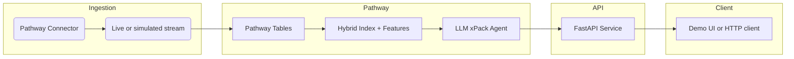

# System Architecture

```mermaid
flowchart LR
  subgraph Ingestion
    connector(Pathway Connector)
    stream(Live or simulated stream)
  end

  subgraph Pathway
    table[Pathway Tables]
    index[Hybrid Index + Features]
    llm[LLM xPack Agent]
  end

  subgraph API
    fastapi[FastAPI Service]
  end

  subgraph Client
    ui[Demo UI or HTTP client]
  end

  connector --> stream --> table --> index --> llm
  llm --> fastapi --> ui
```

You can open this file directly on GitHub and the diagram will render automatically.
